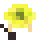
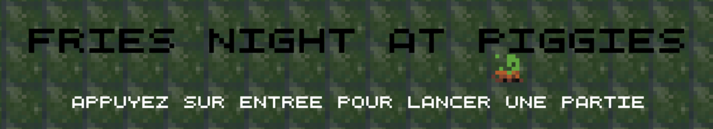
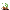
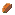
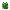

# Confiture-de-jeu

### E-Pygame est fier de vous présenter son premier jeu : __Fries Night At Piggies__ 

---

---

#### __Contexte :__ 
Dans ce jeu vous incarnerez un fermier.
Vous devrez vous balader afin de récolter des patates  pour nourir vos cochons .
Un fois nourris, vos cochons vous sont redevables et frieront les patates  pour en faire des frites qu'ils pourront tirer sur les zombies  qui vous suivent et vous attaquent.

#### __Pré-requis :__
- Python 3
- Bibliothèque python :
    - pygame
    - numpy

#### __Installation :__
- Télécharger la dernière [release](https://github.com/MariusROBERT/confiture-de-jeu/releases)
- Décompresser le zip
- Dans un terminal, exécuter la commande `pip3 install -r requirements.txt`
- Une fois les bibliothèques installées, exécuter le script `main.py` 

#### __Comment jouer :__
Lorsque le jeu est lancé, un tutoriel vous est affiché.
Utilisez les flèches du clavier ou `ZQSD` pour vous déplacer.
Quand vous arrivez sur une patate, appuyez sur `espace` pour la ramasser, vous pouvez en récolter jusqu'à 5 dans votre inventaire.
La touche `espace` sert aussi à nourrir les cochons avec les patates lorsque vous êtes à proximité d'eux.
Des bonus peuvent apparaitre sur la map, vous pouvez les ramasser de la même manière que les patates mais ils vous donneront une charge. Vous pouvez en stocker jusqu'à 3.
Appuyez sur `B` pour utiliser une charge de votre pouvoir. Cela créé une explosion autour de vous qui tue les zombies proches.

Lorsqu'un zombie meurt, vous gagnez des points.

Vous perdez de la vie lorsqu'un zombie vous touche, votre barre de vie s'affiche en haut à gauche.
Lorsque vous récupérez 5 patates, vous vous régénérez quelques points de vie.
Une fois votre descendue à 0, vous perdez la partie et votre score est affiché.

Vous pouvez alors appuyer sur `entrée` pour recommencer une partie.

#### __Customisation :__
Vous pouvez modifier le fichier `config.json` pour changer de datapack.
3 datapacks sont fournis et placés dans le dossier `datapacks`.
Pour créer un datapack, recopier la structure de ceux existant, les sons sont optionnels.
Les images dans des dossier contenants seulement des images sont des animations image par image affichées par ordre alphabétique.
Les autres images sont des images fixes qui doivent être nommées exactement comme dans les autres datapacks.

---

##### __Crédits :__
- Images et animations : Mathian Thibault
- Sound Design : Lefranc Nicolas
- Lead Dev : Piernas Loïc
- Mathematics : Piernas Loïc
- Dev : Robert Marius, Piernas Loïc, Lefranc Nicolas, Mathian Thibault